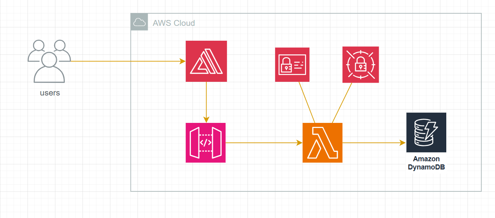

## Avaliação de conhecimentos em Desenvolvimento de Software

Foi construído um sistema para geração e exibição de senhas, para evitar que as mesmas fossem compartilhadas via e-mail, sms ou aplicativos terceiros de mensagem. [Clique aqui para acessar](https://application-matheus-lima.d1tmawor3xqx2z.amplifyapp.com/home "Clique aqui para acessar")

#### - Construção do Sistema



Toda a infraestrutura do projeto foi desenvolvida com base no conceito de **serverless**. Para o front-end, foi criada uma aplicação em **React e TypeScript** que apresenta um formulário simples para a definição de políticas de senha, permitindo tanto o preenchimento manual quanto a geração automática de senhas pelo sistema. A aplicação também inclui um modal que exibe o link para visualização de uma senha gerada e uma tela específica para essa ação. O **AWS Amplify** foi utilizado para o deploy dessa aplicação front-end.

Essa aplicação se comunica com uma API REST, disponibilizada por meio do **AWS API Gateway**, que atua como intermediário entre o cliente web e o back-end. O back-end, construído em **Python**, é gerido por funções do **AWS Lambda**.

No back-end, as informações de senha são manipuladas e armazenadas em uma tabela no **AWS DynamoDB**, que possui os seguintes atributos: id (identificador do registro), deadline (prazo de validade do registro, **utilizado para configurar o TTL**), remaining-queries (quantidade de consultas restantes ao registro), e value (valor da senha criptografada). As operações no back-end foram organizadas em duas rotas:

**1) Gerar Senha**

[POST] ${URL}/password
```
{
  "policies": {
    "uppercase": boolean,
    "lowercase": boolean,
    "numeric": boolean,
    "special": boolean
  },
  "minLength": integer,
  "maxAttempts": integer,
  "availabilityTime": integer,
  "password": string | null
}
```

Esse *endpoint* recebe as políticas de senha que devem ser seguidas, o número mínimo de caracteres exigido, o número máximo de consultas permitidas, o tempo de disponibilidade da senha em segundos, e um valor de senha em formato de string - caso o usuário tenha escolhido sua própria senha - se o valor de senha for nulo, o back-end quem gerará a senha. As senhas geradas são criptografadas por um algoritmo de criptografia simétrica, utilizando uma chave armazenada no **AWS Secrets Manager** para evitar exposição em código *hardcoded*. O formato da resposta segue o padrão:
```
{
    "id": string
}
```

**2) Consultar Senha **

[GET] ${URL}/password/${passwor-id}

Esse *endpoint* retorna a senha solicitada, desde que ainda esteja dentro do prazo de validade e não tenha excedido o número máximo de consultas permitidas. Essas verificações também removem senhas que não atendem mais a esses critérios, garantindo redundância caso o TTL (configurado no DynamoDB) ainda não tenha realizado a exclusão ou o limite de consultas tenha sido atingido. Como resultado, a senha descriptografada é retornada:
```
{
    "password": string
}
```

#### - Organização de pastas do back-end

```
src/
├── interfaces/
│   ├── controllers/
│   └── presenters/
├── repositories/
├── services/
├── usecases/
│   └── errors/
└── app.py
```

A estrutura segue princípios de Clean Architecture, sendo escolhido pensando em expor uma visão de projeto voltada a colaboração, clareza e manutenção, reutilização de código e escalabilidade.

- *Controllers*: responsáveis por lidar com as requisições externas, recebendo as entradas de usuário e chamando os casos de uso apropriados;

- *Presenters*: isolam e padronizam as respostas do restante da aplicação;

- *Repositories*: responsáveis pelas ações de persistência de dados, forecendo uma abastração para essa camada;

- *Services*: encapsulam operações/funcionalidades centralizando essas lógicas;

- *Usecases*: contemplam a lógica de negócios, coordenando a execução das tarefas e manipulação de dados connforme as regras.
